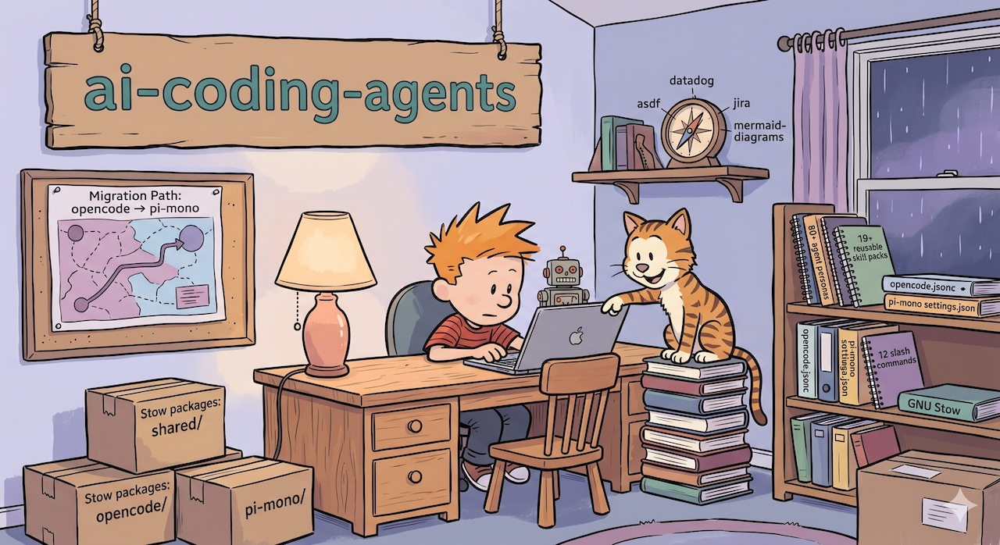

<div align="center">
  <h1>ai-coding-agents</h1>
  
  <p><strong>Personal AI agent configuration managed with GNU Stow — shared across opencode and pi-mono.</strong></p>
</div>

<p align="center">
  <a href="https://awesome.re"></a>
  <a href="https://github.com/jjmartres/ai-coding-agents"></a>
  <a href="https://github.com/jjmartres/ai-coding-agents/issues"></a>
  <a href="https://github.com/jjmartres/ai-coding-agents/pulls"></a>
</p>

---

> **Migration notice**
>
> I am migrating from **opencode** to **pi-mono**. This repository replaces
> [jjmartres/opencode](https://github.com/jjmartres/opencode), which is now
> archived and read-only. During the transition both agent tools are supported
> here. This is the long-term home for all shared agent configuration going
> forward.

---

## Table of Contents

- [What this repo is](#what-this-repo-is)
- [Prerequisites](#prerequisites)
- [Repository structure](#repository-structure)
- [Stow packages](#stow-packages)
- [Installation](#installation)
- [Make targets](#make-targets)
- [Pre-commit hooks](#pre-commit-hooks)
- [Development](#development)
- [Troubleshooting](#troubleshooting)
- [Contributing](#contributing)
- [Architecture](docs/ARCHITECTURE.md)

## What this repo is

Three [GNU Stow](https://www.gnu.org/software/stow/) packages, all targeting
`$HOME`, that deploy:

- **103 agent persona files** shared between opencode and pi-mono
- **26 reusable skill packs** covering diagrams, code docs, Jira, Datadog, robotics, Google Cloud, and more (plus 125+ on-demand official Google Cloud skills)
- **18 slash commands** for common workflows (worktree isolation, commit, review, test, speckit, …)
- **opencode-specific** configuration (migrated natively to OpenCode V2): `opencode.jsonc`, `cli.json`, MCP servers, plugins
- **pi-mono-specific** configuration: settings, models, TypeScript extensions

## Prerequisites

| Tool | Purpose | Required |
|------|---------|----------|
| [GNU Stow](https://www.gnu.org/software/stow/) | Symlink farm manager | Yes |
| [opencode](https://opencode.ai) | AI coding agent (V2 native) | If using the `opencode` package |
| [pi-mono](https://github.com/mariozechner/pi) | AI coding agent | If using the `pi-mono` package |
| [Node.js](https://nodejs.org/) v18+ | JSONC validation script | Yes |
| [TypeScript](https://www.typescriptlang.org/) | pi-mono extension typechecking | Yes (`npm install -g typescript`) |
| [pre-commit](https://pre-commit.com/) | Git hook framework | Optional |
| [jq](https://jqlang.github.io/jq/) | JSON query engine (Google skills index) | Yes |
| [Fish](https://fishshell.com/) | Shell runtime for Google skills scripts | Yes |

**macOS:**

```bash
brew install stow node pre-commit jq fish
npm install -g typescript
```

## Repository structure

```
ai-coding-agents/
├── shared/                          # Stow package 1 — shared across both agents
│   └── .ai-agents/
│       ├── agents/                  # 103 agent persona .md files across 11 categories
│       │   ├── 00-general/
│       │   ├── 01-core/
│       │   ├── 02-languages/
│       │   ├── 03-infrastructure/
│       │   ├── 04-quality-and-security/
│       │   ├── 05-data-ai/
│       │   ├── 06-developer-experience/
│       │   ├── 07-specialized-domains/
│       │   ├── 08-business-product/
│       │   ├── 09-meta-orchestration/
│       │   └── 10-curiosity/
│       ├── commands/                # Shared slash commands (18 workflows)
│       │   ├── astro-dso-doc.md
│       │   ├── call-agent.md        # Dynamic agent caller with fuzzy matching & aliases
│       │   ├── commit.md
│       │   ├── commit-and-create-mr.md
│       │   ├── compose-email.md
│       │   ├── datadog.md
│       │   ├── documentation.md
│       │   ├── fix-renovate-mr.md
│       │   ├── memory-bank.md
│       │   ├── next-sprint-design.md
│       │   ├── prepare-dataset.md
│       │   ├── review.md
│       │   ├── speckit.polish.md
│       │   ├── test.md
│       │   ├── worktree.create.md   # Isolated worktree creation & session move
│       │   ├── worktree.delete.md   # Worktree & branch cleanup / prune
│       │   ├── worktree.list.md     # Active worktree & PR/MR status monitor
│       │   └── worktree.md          # Unified worktree command router
│       ├── rules/
│       │   ├── git-worktree.md      # Worktree isolation & session relocation
│       │   ├── google-cloud.md      # Router rule for Google Cloud skills
│       │   └── memory-bank.md
│       ├── scripts/                 # Shared helper utilities
│       │   └── match-agent.js       # Dynamic fuzzy agent matching with alias & typo tolerance
│       └── skills/                  # Reusable skill packs
│           ├── asdf/
│           ├── astro-dso-doc/
│           ├── content-research-writer/
│           ├── corp-branding/
│           ├── corp-operations-infrastructure/
│           ├── datadog/
│           ├── document-code/
│           ├── document-project/
│           ├── file-organizer/
│           ├── gcloud/              # Direct symlink to vendor/google-skills/.../gcloud (guardrail)
│           ├── glab/
│           ├── google-skills/       # On-demand router for official Google Cloud skills
│           ├── graphify/
│           ├── httpie/
│           ├── humanizer/
│           ├── jira/
│           ├── karpathy-guidelines/
│           ├── marp-slide/
│           ├── mcp-builder/
│           ├── meeting-insights-analyzer/
│           ├── mermaid-diagrams/
│           ├── nibbler/
│           ├── reachy-mini-sdk/     # git submodule
│           ├── work-on-ticket/
│           ├── worktrunk/
│           └── writing-clearly-and-concisely/
│
├── opencode/                        # Stow package 2 — opencode-specific (OpenCode V2 native)
│   └── .config/opencode/
│       ├── opencode.jsonc           # Server & agent config (providers, compaction, default_agent)
│       ├── cost-guard.config.jsonc
│       ├── cli.json                 # Terminal & TUI config (replaces legacy V1 tui.jsonc)
│       └── themes/                  # Theme documentation (Catppuccin bundled natively in V2)
│
├── pi-mono/                         # Stow package 3 — pi-mono-specific
│   └── .pi/agent/
│       ├── settings.json
│       ├── models.json
│       ├── auth.json
│       ├── themes/
│       └── extensions/              # TypeScript extensions
│           ├── agents.ts
│           ├── aliases.ts
│           ├── git-checkpoint.ts
│           ├── permission-gate.ts
│           ├── piline.ts
│           ├── protected-paths.ts
│           ├── rules.ts
│           ├── sessions-management.ts
│           ├── skills-searcher.ts
│           ├── skills.ts
│           ├── todo.ts
│           ├── tps.ts
│           └── usage.ts
│
├── vendor/                          # Submodules outside Stow (avoids context bloat)
│   └── google-skills/               # Pinned submodule: 125+ official Google Cloud skills
│
├── scripts/
│   ├── google-skills-gen-index.fish # Generates local index for on-demand Google skills
│   ├── update-google-skills.fish    # Interactive updater for google-skills submodule
│   └── validate-jsonc.js
├── .pre-commit-config.yaml
├── .stowrc
└── Makefile
```

## Stow packages

### `shared/` → `~/.ai-agents/`

Contains everything that both opencode and pi-mono consume: agent personas,
skill packs, slash commands, and rules. Stow maps the contents of
`shared/` directly into `$HOME`, so `shared/.ai-agents/` lands at
`~/.ai-agents/`.

### `opencode/` → `~/.config/opencode/`

OpenCode V2 native application configuration: main `opencode.jsonc` (migrated to V2 declarative schema with
`experimental.policies` and native autocompaction), cost-guard settings, terminal & TUI preferences
(`cli.json`, which replaces legacy V1 `tui.jsonc`), plugins,
and bundled Catppuccin theme integration.

**Shared symlinks (not managed by Stow)**

OpenCode expects agents, skills, commands, rules, and helper scripts under
`~/.config/opencode/`. Stow cannot map the same source directory to two
different destinations, so `make install` (or `make link-shared`) creates these symlinks
separately:

```
~/.config/opencode/agents/   →  flattened symlinks to all 103 ~/.ai-agents/agents/*/*.md
~/.config/opencode/skills    →  ~/.ai-agents/skills
~/.config/opencode/commands  →  ~/.ai-agents/commands
~/.config/opencode/rules     →  ~/.ai-agents/rules
~/.config/opencode/scripts   →  ~/.ai-agents/scripts
```

Run `make link-shared` to create them independently, or `make link-agents` to re-flatten agent symlinks. See `make status` to verify.

### `pi-mono/` → `~/.pi/`

pi-mono application config: settings, model definitions, auth, themes, and a
set of TypeScript extensions that add custom behaviour (agent loading, skill
search, session management, git checkpoints, usage tracking, and more).

## Installation

```bash
# Clone (include submodules)
git clone --recurse-submodules https://github.com/jjmartres/ai-coding-agents.git
cd ai-coding-agents

# Stow all packages, init submodules, generate local Google skills index, and create shared symlinks
make install

# (Optional) Install pre-commit hooks
make install-hooks
```

After install, symlinks under `$HOME` point back into this repo. Edit files
here; changes take effect immediately.

## Make targets

```
Installation
  install              Stow all packages + init submodules + gen local index + create shared symlinks
  submodules           Initialize and update git submodules
  stow-install         Stow all packages only
  link-shared          Create ~/.config/opencode/{skills,commands,rules,scripts} and flat agents symlinks
  link-agents          Create flat symlinks in ~/.config/opencode/agents/ for all 103 agents
  unlink-agents        Remove flat agent symlinks in ~/.config/opencode/agents/
  unlink-shared        Remove ~/.config/opencode/{agents,skills,commands,rules,scripts} symlinks
  uninstall            Remove shared symlinks + unstow all packages
  restow               Re-run stow (use after adding/removing files)

Google Cloud Skills
  gen-google-skills-index Generate local index for Google Cloud skills
  update-google-skills Check upstream diff and prompt to update Google Cloud skills submodule

Utilities
  check                Verify setup (directories, stow binary, .stowrc)
  status               Show linked packages and shared symlinks state
  clean                Remove broken symlinks under ~/.ai-agents and ~/.config/opencode

Pre-commit hooks
  install-hooks        Install pre-commit hooks
  uninstall-hooks      Remove pre-commit hooks
  run-hooks            Run all hooks against all files
  update-hooks         Update hooks to latest versions
```

## Pre-commit hooks

| Hook | What it checks |
|------|---------------|
| `check-stowrc-exists` | `.stowrc` is present |
| `validate-makefile` | Makefile parses without syntax errors |
| `typecheck-extensions` | pi-mono TypeScript extensions pass `tsc --noEmit` |
| `validate-jsonc` | All `.jsonc` files are valid JSON-with-comments |
| `trailing-whitespace` | No trailing whitespace |
| `end-of-file-fixer` | Files end with a newline |
| `check-yaml` | YAML files are valid |
| `check-json` | JSON files (non-JSONC) are valid |
| `check-added-large-files` | No files larger than 1 MB |
| `check-merge-conflict` | No leftover conflict markers |
| `detect-private-key` | No accidental private key commits |
| `mixed-line-ending` | Enforces LF line endings |
| `markdownlint` | Markdown in `shared/` passes `.markdownlint.yaml` |
| `shellcheck` | Shell scripts pass `shellcheck --severity=warning` |

## Development

### Adding an agent

Create a `.md` file in the appropriate category under
`shared/.ai-agents/agents/`. No re-stowing needed — the directory is already
symlinked.

### Adding a skill

Create a subdirectory under `shared/.ai-agents/skills/` with a `SKILL.md`
entry point. Same as agents: no re-stowing needed.

### Updating Google Cloud skills

Official Google Cloud skills are vendored as a pinned git submodule in `vendor/google-skills` (~129 skills). To inspect upstream changes and update the pin safely:

```bash
make update-google-skills
```

This interactive script fetches upstream, displays commit history and diff statistics, and requests explicit user confirmation before advancing the submodule pointer. Once confirmed, it automatically regenerates the local search index (`generated/google-skills-index.local.json`).

To regenerate the index manually:

```bash
make gen-google-skills-index
```

### Adding or removing files in a stow package

After adding or deleting files in `opencode/` or `pi-mono/`:

```bash
make restow
```

### Running hooks manually

```bash
make run-hooks

# Or target a single hook
pre-commit run typecheck-extensions --all-files
pre-commit run markdownlint --all-files
```

### Updating configuration

```bash
git pull origin main
make restow
```

## Troubleshooting

**Symlinks not created / stow conflicts**

```bash
make status          # check what's linked
make clean           # remove broken symlinks
make uninstall
make install
```

**Agents not loading in opencode**

```bash
# Verify the shared symlinks exist
ls -la ~/.config/opencode/agents ~/.config/opencode/skills

# Recreate them if missing
make link-shared
```

**TypeScript typecheck fails**

```bash
# Ensure tsc is available
npm install -g typescript

# Run the check manually
pre-commit run typecheck-extensions --all-files
```

**JSONC validation fails**

```bash
# Ensure Node.js >= 18 is installed
node --version

# Run the check manually
pre-commit run validate-jsonc --all-files
```

**Submodule missing or empty**

```bash
# If you cloned without --recurse-submodules
make submodules

# Or manually
git submodule update --init --recursive
```

## Contributing

See [CONTRIBUTING.md](CONTRIBUTING.md) for how to add agents, skills, commands, and rules, coding standards, and how the pre-commit hooks work.

---

MIT License — see [LICENSE](LICENSE).
