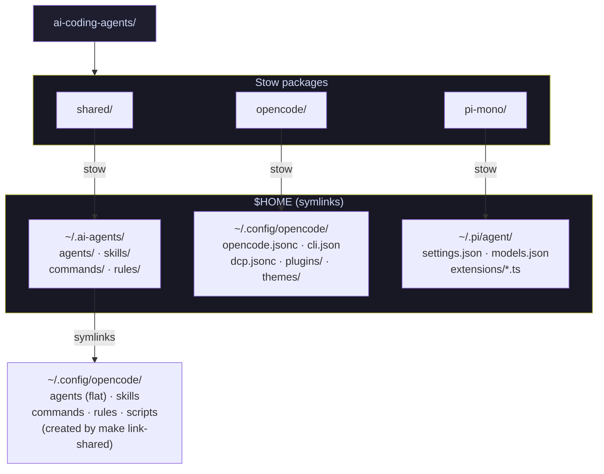
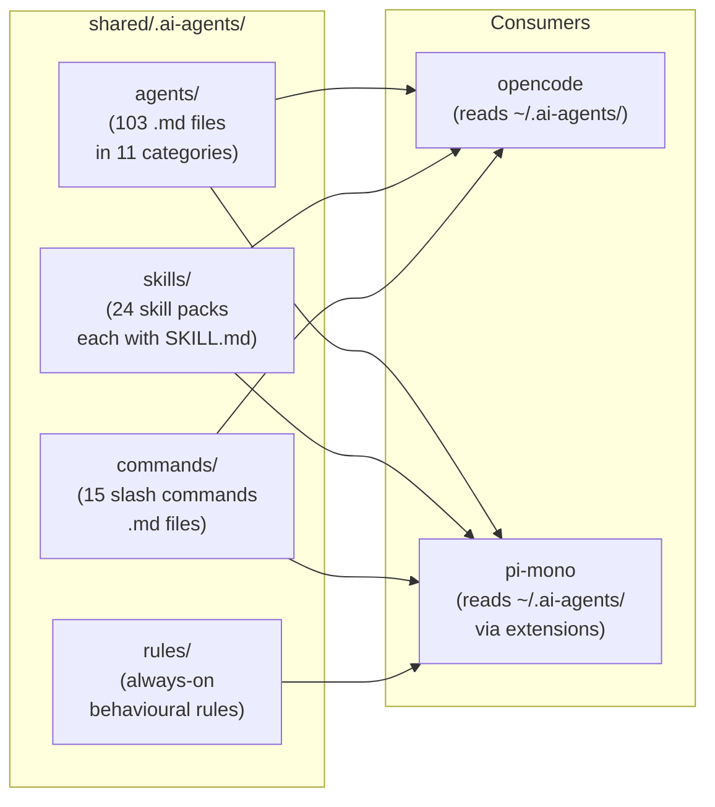
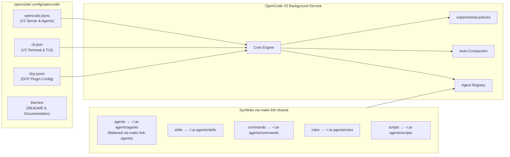
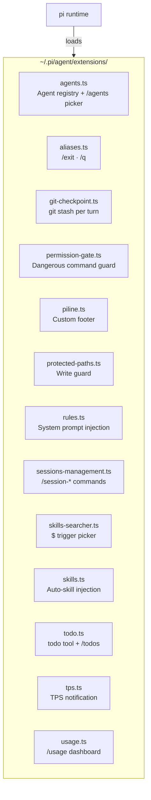
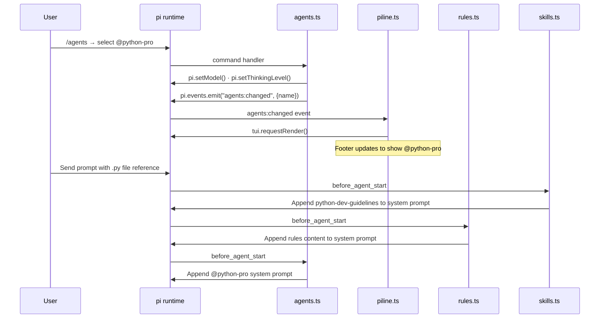

# Architecture

[← Back to README](../README.md)

This document describes the structure of `ai-coding-agents`, how the three Stow packages are deployed to `$HOME`, and how the pi-mono extensions interact at runtime.

## Table of contents

- [Repository layout](#repository-layout)
- [Stow deployment model](#stow-deployment-model)
- [Shared package structure](#shared-package-structure)
- [OpenCode V2 architecture & migration](#opencode-v2-architecture--migration)
- [Pi-mono extensions](#pi-mono-extensions)
- [Extension interaction map](#extension-interaction-map)
- [Memory bank location](#memory-bank-location)

---

## Repository layout

The repository contains three independent [GNU Stow](https://www.gnu.org/software/stow/) packages. Each package mirrors the directory structure under `$HOME`, so `stow <package>` creates the corresponding symlinks.

```
ai-coding-agents/
├── shared/          # → $HOME  (agents, skills, commands, rules)
├── opencode/        # → $HOME  (opencode V2 config: opencode.jsonc, cli.json, dcp.jsonc)
├── pi-mono/         # → $HOME  (pi settings and TypeScript extensions)
├── scripts/         # Utility scripts (JSONC validator)
├── docs/            # Project documentation
├── Makefile
└── .pre-commit-config.yaml
```

---

## Stow deployment model



`make install` runs `stow` for all three packages and then creates the shared
symlinks under `~/.config/opencode/` pointing to `~/.ai-agents/` (flattened agents,
skills, commands, rules, and scripts), because Stow cannot map the same source directory to
two different destinations. Use `make link-shared` to create these symlinks
independently.

---

## Shared package structure

The `shared/` package provides everything that both opencode and pi-mono consume:
agents, skills, commands, rules, and helper scripts.



### Agent categories

Agents are organised into 11 numbered directories under `agents/`. The prefix
controls display order in the picker:

| Directory | Domain |
|-----------|--------|
| `00-general/` | General-purpose and communication |
| `01-core/` | Backend, API, fullstack, microservices |
| `02-languages/` | Language-specific experts (Python, Go, TS, …) |
| `03-infrastructure/` | DevOps, Kubernetes, cloud, SRE |
| `04-quality-and-security/` | QA, code review, penetration testing |
| `05-data-ai/` | Data engineering, ML, LLM architecture |
| `06-developer-experience/` | DX, CLI, build, documentation |
| `07-specialized-domains/` | Fintech, blockchain, music, payments |
| `08-business-product/` | Product, legal, UX, marketing |
| `09-meta-orchestration/` | Multi-agent coordination and context |
| `10-curiosity/` | Research, trend analysis, market intelligence |

---

## OpenCode V2 architecture & migration

The OpenCode configuration in `opencode/` is built natively for OpenCode V2, migrating away from legacy V1 structures while keeping shared assets seamlessly linked.



### OpenCode V2 native configuration files

OpenCode V2 separates concerns across three dedicated configuration files:

1. **`opencode.jsonc`** (`~/.config/opencode/opencode.jsonc`):
   - Schema: `https://opencode.ai/config.json`
   - Core server, provider, and agent configuration.
   - Manages model assignments, `"default_agent": "devops-engineer"`, custom inline agents (`agents.title`), declarative provider policies (`experimental.policies` using `provider.use`), provider connection settings, auto-compaction thresholds, tool output limits (`tool_output.max_lines: 800`, `tool_output.max_bytes: 32768`), MCP servers, and plugin registrations.
   - **Context Compaction Settings**:
     ```jsonc
     "compaction": {
       "auto": true,
       "keep": {
         "tokens": 20000
       },
       "buffer": 32000
     }
     ```
     - `"auto": true`: Automatically executes context compaction when cumulative turn tokens approach model limits.
     - `"keep": { "tokens": 20000 }`: Preserves a rolling tail of recent context up to 20,000 tokens during compaction summaries, maintaining conversation context and immediate working memory.
     - `"buffer": 32000`: Reserves a 32,000-token safety buffer below the model's usable context window, triggering compaction well before token overflow or truncation errors occur.

2. **`cli.json`** (`~/.config/opencode/cli.json`):
   - Schema: `https://opencode.ai/v2/cli.json`
   - Global terminal and TUI preferences (replaces legacy V1 `tui.jsonc`).
   - **V1-Style Prompt Queuing (`"prompt.queue": "return"`)**: Configured under `keybinds`, this restores OpenCode V1 queuing behavior where hitting `Return` while a tool or turn is running appends the prompt to the execution inbox rather than blocking.
   - **Transcript Grouping (`"session.grouping": "none"`)**: Renders each tool execution and turn item separately rather than collapsing them into grouped bundles, providing clear inspection of operations.
   - **Theme Configuration (`"theme": { "name": "zenburn" }`)**: Selects the active syntax and UI palette (`zenburn`, with alternatives like `tokyonight` or `catppuccin-macchiato`).
   - **Attention Alerts (`"attention": { ... }`)**: Configures desktop notifications (`"notifications": true`) when the terminal window is in the background, and plays attention sounds (`"sound": true`, `"volume": 0.4`) on events such as permission prompts, user questions, task completions, and subagent completion (`subagent_done`).

3. **`dcp.jsonc`** (`~/.config/opencode/dcp.jsonc`):
   - Schema: `https://raw.githubusercontent.com/Opencode-DCP/opencode-dynamic-context-pruning/master/dcp.schema.json`
   - Dynamic Context Pruning (`@tarquinen/opencode-dcp` plugin) settings.
   - **Autonomous Context Pruning**:
     - `"manualMode": { "enabled": false, "automaticStrategies": true }`: Operates autonomously in the background without prompting for manual strategy confirmation.
     - `"compress": { "mode": "range", "permission": "allow", "showCompression": false, "summaryBuffer": true }`: Applies range-based compression to stale multi-turn exchanges, auto-approves compression actions, and retains intermediate summaries in memory across extended multi-agent interactions.

### Key V1 to V2 migration changes

| Area | OpenCode V1 (Legacy) | OpenCode V2 (Native) |
|------|----------------------|----------------------|
| **TUI Configuration** | `tui.jsonc` | Global `cli.json` (`$schema: https://opencode.ai/v2/cli.json`) |
| **Prompt Queuing** | `Enter` queued prompts while active | `"prompt.queue": "return"` in `cli.json` restores V1 queuing behaviour |
| **Provider Config** | `provider` array with `options` | `providers` map with `settings` (`baseURL`, `apiKey`, `project`, `location`) |
| **Provider Permissions** | `enabled_providers` list | Declarative `experimental.policies` rules using `provider.use` |
| **Model Capabilities** | Top-level flags / unstructured | Explicit `capabilities` (`tools: true`, `input`, `output`) |
| **Context Compaction** | `preserve_recent_tokens`, `reserved`, `tail_turns`, `prune` | `"compaction": { "auto": true, "keep": { "tokens": 20000 }, "buffer": 32000 }` |
| **Attention Alerts** | Unstructured or disabled | `"attention": { "notifications": true, "sound": true, "volume": 0.4 }` in `cli.json` |
| **Session Titling** | `small_model` string | `agents.title.model` (Gemini 3.8 Flash) and `agents.title.system` instructions |
| **Default Agent** | `default_agent: "build"` | `"default_agent": "devops-engineer"` (clean flat ID) |
| **Agent Discovery** | Directory-prefixed IDs | `make link-agents` flattens all 103 agents into `~/.config/opencode/agents/` |
| **Agent Invocation** | Native V1 `@agent` prompts | Dynamic `/call-agent` slash command (fuzzy matching) + `subagent` tool delegation |
| **Theme Bundling** | Custom JSON theme files in `themes/` | Native themes (`theme.name: "zenburn"`, `catppuccin-macchiato`, etc.), obsolete V1 theme files removed |
| **Tool Execution Grouping** | Ungrouped or unstructured | `session.grouping: "none"` (individual item rendering) in `cli.json` |
| **Context Pruning** | Manual or unconfigured | `@tarquinen/opencode-dcp` with autonomous compression (`manualMode.enabled: false`) |
| **Configuration Reload** | Full restart required | Hot reload via `opencode reload` command without dropping sessions |

### Agent invocation in OpenCode V2

OpenCode V2 re-architected `@` in the terminal TUI for file and symbol context attachments (`@path/to/file`). To preserve seamless agent workflows, this repository implements four coordinated invocation mechanisms:

1. **Flattened Agent IDs via `make link-agents`**:
   - OpenCode V2 derives agent IDs from their directory path relative to the agent root (e.g. `03-infrastructure/devops-engineer.md` would be registered as `03-infrastructure/devops-engineer`).
   - `make link-agents` (run automatically during `make install` and `make link-shared`) scans all 103 agent Markdown files across the categorized subdirectories (`00-general/` through `10-curiosity/`) and symlinks them flat into `~/.config/opencode/agents/<name>.md`.
   - Produces clean, flat IDs (`devops-engineer`, `kubernetes-specialist`, `documentation-engineer`) for picker selection, slash commands, and subagent spawning.
2. **Agent Mode Requirements (`mode: primary` vs `mode: subagent` vs `mode: all`)**:
   - `mode: primary`: Runs as the primary session agent in interactive TUI or CLI sessions. This is the default when `mode` is omitted on a custom agent. Selectable via `/agents`, `<leader>a`, or `--agent`. **Cannot** be invoked as a subagent by the `subagent` tool (attempts to do so will fail).
   - `mode: subagent`: Runs exclusively inside an isolated child session spawned by the `subagent` tool with fresh context. Excluded from primary selection and cannot be set as `default_agent`.
   - `mode: all`: Dual capability. Can run both as a primary session agent and as a delegated subagent in child sessions.
   - *Rule*: Any agent invoked via delegation directives or the `subagent` tool must declare `mode: subagent` or `mode: all`.
3. **Dynamic `/call-agent` Slash Command**:
   - Template: `shared/.ai-agents/commands/call-agent.md`.
   - Engine: `shared/.ai-agents/scripts/match-agent.js`.
   - Executes `/call-agent <agent> <query>` with fuzzy matching, alias resolution, and typo tolerance (e.g. `/call-agent depovs-enginer review the pipeline`), dynamically injecting the matched agent persona instructions into the conversation turn.
4. **Subagent Child Sessions & TUI Navigation**:
   - Subagents run in isolated child sessions with fresh context via OpenCode's `subagent` tool (foreground or background).
   - Target subagents must declare `mode: subagent` or `mode: all`.
   - **TUI Navigation Shortcuts**:
     - **`Down` Arrow** (`session.child.first` / `composer.subagent.down`) or **`Enter`** (`composer.subagent.select`): Step into / drill down into a child session to inspect live tool calls, shell execution, output, and progress.
     - **`Up` Arrow** (`session.parent` / `composer.subagent.up`): Return from the child session back to the parent session.
     - **`Left` Arrow** (`session.child.previous`) / **`Right` Arrow** (`session.child.next`): Switch horizontally between sibling child sessions.
     - **`Ctrl+D`** (`composer.subagent.interrupt`): Interrupt a running child subagent.
     - **`Ctrl+B`** (`session.background`): Background a blocking foreground subagent or tool call.

---

## Pi-mono extensions

Extensions in `pi-mono/.pi/agent/extensions/` are TypeScript files loaded
automatically by pi on startup. Each file exports a default function that
receives the `ExtensionAPI` and registers hooks, commands, and tools.



---

## Extension interaction map

Some extensions communicate with each other rather than operating in isolation.
The primary coupling is between `agents.ts` and `piline.ts` via the event bus.



### Event bus usage

| Event emitted | Source | Consumers |
|---------------|--------|-----------|
| `agents:changed` | `agents.ts` | `piline.ts` |

All other inter-extension communication happens through pi's built-in lifecycle
events (`session_start`, `turn_start`, `before_agent_start`, `tool_call`, etc.).

---

## Memory bank location

The memory bank rule (`shared/.ai-agents/rules/memory-bank.md`) stores session
context in `.ai-agents/memory-bank/` inside the project root. If a legacy
`.opencode/memory-bank/` directory is found, the rule migrates it automatically.

```
<project-root>/
└── .ai-agents/
    └── memory-bank/
        ├── projectbrief.md      # Core requirements and goals
        ├── productContext.md    # Why the project exists
        ├── activeContext.md     # Current focus and next steps
        ├── systemPatterns.md    # Architecture and design decisions
        ├── techContext.md       # Technologies, constraints, dependencies
        └── progress.md          # Status, known issues, decision history
```

The files build on each other in a defined hierarchy — `projectbrief.md` is
the foundation; `progress.md` and `activeContext.md` change most frequently.
